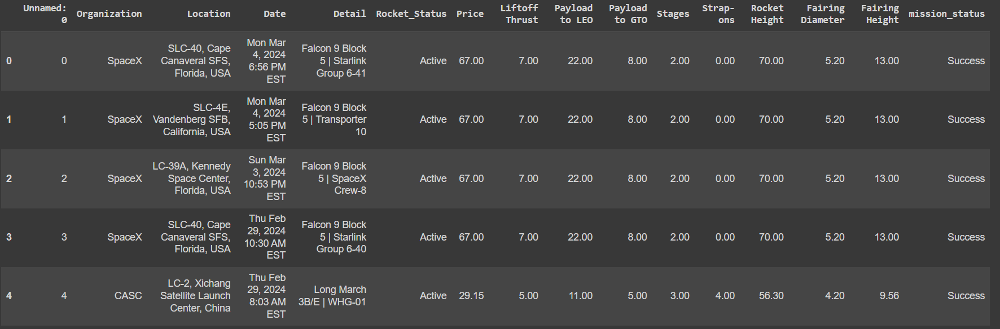

<h1 align="center">Space Flight Data Scraping Bot</h1>

This bot is designed to automatically retrieve the latest space flight data since 1957 from <a href="https://nextspaceflight.com/launches/past/?search=">next spaceflight</a>.

<h2>Getting Started</h2>

These instructions will guide you through setting up and running the bot on your local machine for development and testing purposes.

<h2>Prerequisites</h2>

Before you begin, ensure you have the following installed:

<ul>
<li>Python 3.6 or higher</li>
<li>pip (Python package installer)</li>
<li>Chrome Webdriver</li>
</ul>

<h2>Installation</h2>

<h3>Clone the Repository</h3>

First, clone this repository to your local machine using Git:

<pre>
git clone https://github.com/HoneyMeat/spaceflight-scrap.git
</pre>

<h3>Set Up a Virtual Environment</h3>

Navigate to the cloned repository directory and set up a virtual environment to manage the dependencies:

<pre>
cd path_to_repo
python3 -m venv env
</pre>

<h3>Activate the Virtual Environment:</h3>

On Windows:

<pre>
env\Scripts\activate
</pre>

On macOS and Linux:

<pre>
source env/bin/activate
</pre>

<h2>Install Dependencies</h2>

With the virtual environment activated, install the required Python packages:

<pre>
pip install -r requirements.txt
</pre>

<h2>Running the Bot</h2>

To start the bot and begin data scraping and analysis, run:

<pre>
python3 main.py
</pre>

When it's done, run:

<pre>
python3 clean.py
</pre>

<h2>The Bot Will Create a .csv File with This Schema: </h2>

